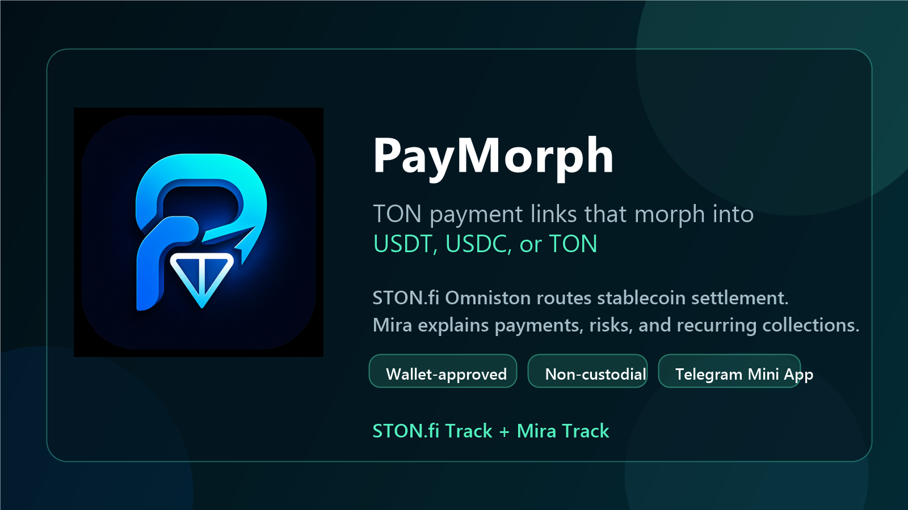

# PayMorph

**Agent-assisted TON payment links powered by STON.fi Omniston and Mira.**

PayMorph is a Telegram Mini App and web checkout that makes TON payments easier for both receivers and payers. A merchant, creator, freelancer, or community can create a payment link and choose what they want to receive: **USDT, USDC, or TON**. The customer opens the link and pays from a TON wallet.

For stablecoin invoices, PayMorph uses **STON.fi Omniston** to find a live fixed-output route from TON to the selected token. For TON invoices, PayMorph uses a direct wallet-approved TON transfer. Every payment is non-custodial and requires wallet approval through TonConnect.

Production app: https://paymorph.vercel.app  
Telegram Mini App: https://t.me/Paymorhbot?startapp=create  
Mira evidence: https://github.com/Stella112/PayMorph/tree/main/mira-evidence



## The Problem

TON payments are powerful, but payment checkout still feels awkward for everyday users:

- A receiver may want stablecoins like USDT or USDC.
- A customer may only want to pay from a TON wallet.
- Manual swaps add friction and mistakes.
- Beginners do not always understand route risk, slippage, wallet approval, or settlement status.
- Recurring collections still require manual follow-up.

PayMorph turns that into a simple payment-link workflow.

## The Solution

PayMorph lets a receiver create a wallet-approved payment link:

1. Choose amount and receive token: USDT, USDC, or TON.
2. Share a web checkout link, Telegram Mini App link, or QR code.
3. Customer pays from a TON wallet.
4. STON.fi Omniston routes TON to USDT/USDC when a stablecoin is requested.
5. Direct TON invoices skip routing and send TON directly.
6. Mira helps explain the payment, risk, receipt, and follow-up.

PayMorph never custodies funds, never signs for the user, and never auto-charges customers.

## Why It Is Different

PayMorph is not just a checkout screen. It adds an operations layer around TON payment links:

- **Flexible settlement:** receive USDT, USDC, or TON.
- **STON.fi routing:** TON-to-USDT and TON-to-USDC fixed-output routing through Omniston.
- **Direct TON mode:** no swap, no slippage, no route risk when the receiver wants TON.
- **Telegram-native flow:** works as a Telegram Mini App through `@Paymorhbot`.
- **Mira Ops assistant:** structured prompts let Mira explain invoices, routes, receipts, and risks.
- **Recurring invoice agent:** creates due payment links without auto-charging customers.
- **ForgeLens memory:** stores route observations and settlement history for future comparisons and strategy prompts.

Think of it as **payment links for TON**, upgraded with STON.fi settlement routing and Mira-powered payment operations.

## STON.fi Integration

PayMorph uses STON.fi Omniston for stablecoin receive flows:

- Customer pays TON.
- Receiver wants USDT or USDC.
- PayMorph requests a live fixed-output quote.
- Omniston returns the route, TON input amount, slippage data, and settlement data.
- PayMorph builds a TonConnect wallet transaction.
- The payer approves from their wallet.
- PayMorph tracks settlement and marks routed invoices paid only after Omniston reports `TRADE_STATUS_FULLY_FILLED`.

TON receive flow is intentionally different: it is a direct wallet-approved TON transfer and does not need an Omniston route.

## Mira Integration

Mira is used as the PayMorph Ops assistant in Telegram.

Mira does not currently expose a public API/webhook for PayMorph to call directly, so the MVP uses a practical prompt/context bridge:

- PayMorph generates structured prompts for Mira.
- PayMorph publishes product context at https://paymorph.vercel.app/mira-context.txt.
- The user pastes prompts into the PayMorph Ops Telegram group.
- Mira explains routes, slippage, invoice status, recurring reminders, receipts, and treasury strategy.

Evidence of usage is included here:

- https://github.com/Stella112/PayMorph/tree/main/mira-evidence

## Agentic Payment Operations

PayMorph includes transparent, non-custodial agents:

- **Collections Agent:** creates recurring invoice links when schedules become due.
- **Route Guardian:** compares live Omniston routes against ForgeLens history.
- **Risk Guard:** flags elevated slippage or route conditions before wallet approval.

The agents coordinate and explain. They do **not** move funds automatically. Every real payment still requires manual wallet approval.

## ForgeLens

ForgeLens is PayMorph's payment memory layer.

It records:

- Live Omniston quote observations.
- Resolver and route count.
- Recommended slippage.
- Completed settlement receipts.
- Direct TON payment history.

This memory becomes context for Mira, so future route explanations and treasury suggestions can refer to real PayMorph history instead of starting from zero.

## Demo Flow

1. Open https://paymorph.vercel.app.
2. Create a tiny invoice, such as `0.01 USDC`.
3. Copy the web or Telegram checkout link.
4. Open it as the payer.
5. Show the live Omniston quote.
6. Show TonConnect wallet approval.
7. Copy the Mira prompt and paste it in the PayMorph Ops group.
8. Show Mira explaining the route, risk, and receipt.
9. Open the Agents tab and show recurring invoice creation.

Important demo line:

> PayMorph prepares the route, checkout, and agent context. The wallet owner approves every real transaction.

## Current MVP Status

Working:

- Web app and Telegram Mini App
- Payment link creation
- Stateless checkout links
- USDT, USDC, and TON receive-token selection
- Live STON.fi Omniston quotes for TON-to-USDT and TON-to-USDC
- Direct TON transfer flow
- TonConnect wallet transaction building
- Omniston settlement tracking for routed payments
- ForgeLens route and settlement memory
- Recurring invoice agent
- Mira context and prompt handoff

Known MVP limitation:

- Invoice status is local-first. If a payer completes payment in a different browser/account, the merchant dashboard may still show the local invoice as pending unless that same session has the settlement record. A production version would add a backend database and chain indexer to sync settlement state across devices.

## Tech Stack

- React + Vite + TypeScript
- STON.fi Omniston SDK
- TonConnect UI
- Telegram Mini App SDK script
- Vercel deployment
- Mira prompt/context workflow

## Run Locally

```bash
npm install
npm run dev -- --port 5182
```

Open:

```text
http://localhost:5182
```

## Verify Omniston

Verify a live fixed-output quote:

```bash
npm run verify:quote
```

Verify wallet-ready transaction construction for a mainnet wallet address:

```bash
npm run verify:transaction -- <mainnet-wallet-address>
```

The transaction verification command does not sign or broadcast anything.

## Telegram Mini App

Configured bot:

```text
@Paymorhbot
```

Useful links:

```text
https://t.me/Paymorhbot?startapp=create
https://t.me/Paymorhbot?startapp=forgelens
```

Telegram launch parameters supported:

- `create`
- `forgelens`
- `pay_<base64url-invoice-payload>`

Plain `/start` opens the bot chat. Telegram does not automatically open a Mini App from plain `/start`; users should use the Mini App link or bot menu button.

